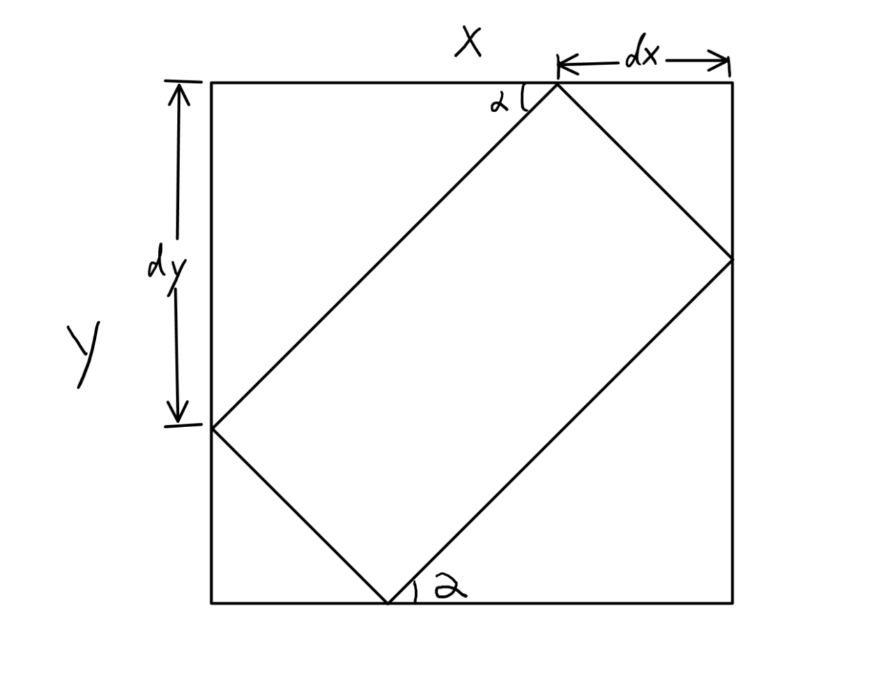

# A Simple Color-based License Plate Detector using only C++ Standard Library (Chinese Blue and Yellow License Plate)

[中文说明](中文说明.md)

***
- This program is a student course project for Fudan University's course *INFO130038 Computer Architecture Spring'17*

- Building Platform: VS2017 + Windows SDK 10.0.10240.0

***

## Usage
  * Open and run the project with VS2017.
  * Input the path of the bmp image.
  * The terminal will display the meta info of the image, the details of all connected regions it finds, and the time of processing.
  * Type any character and enter to terminate the program.
  * The result and the images after each step will be output to the directory `/Output`

## Processing flow
  * `img.imRead(fileName)`   
  * `Rgb2Hsv(&imgHSV1)`
  * `HsvColorDetect(&imgHSV1, &imgHSV2)`   
    Recognizes blue and yellow regions and thresholds the image.
  * `Inflation(&imgHSV2, &imgHSV3, 7, 7)`  
    Image Inflation. Connects small gaps between detected pixels to form connected regions. Inflation Scale 7\*7px.
  * `Erosion(&imgHSV3, &imgHSV4, 6, 6)`  
    Image Erosion, Recovers the borders of the connected regions, Erosion scale 6\*6px。
  * `ConnectedRegion(&imgHSV4, &imgHSV5, featureList)`  
    Finding all connected regions in the image using DFS. Saves all connected region information (area, the position of its minimum bounding rectangle) in `featureList`.
  * `Robert(&imgHSV4, &imgHSV6, 1)`  
    Using Roberts cross operator extracts the border of all the connected region.

    
    ----Dealing with each connected region-----


  * `lineDect(it->boundingbox, &imgHSV6)`  
    Assume all the connected regions are rectangular. Detect the edges and their slopes through Hough transform. The slope of the longest edge can be seem as the angle of rotation of the plate.

  * `countVertices(it->boundingbox);`  
    Modifies the minimum bounding rectangle based on the angle of rotation. Calculates the actual vertices of the plate region based on the following image



  * Selects Reasonable region
    Filters all the connected regions that are unlikely to be a license plate based on the area and the aspect ratio.
  ```c++
  if ((area > img.width * img.height / 400
       && area < img.width * img.height / 10)
       && ((a / b >= 2) || (b / a >=2)))
  ```  

  * `rectangle(&OutputImage, it->boundingbox, 255)`  
    Uses red rectangles to mark all the license plate founded
  * `OutputImage.imWrite()`  

## Limitation
  
This programming can only be used to detect blue and yellow plates, which are most widely used in China. However, it cannot tell the difference of a blue license plate from a similar blue sign. It can also not detect blue plate on blue car or yellow plate on yellow car.