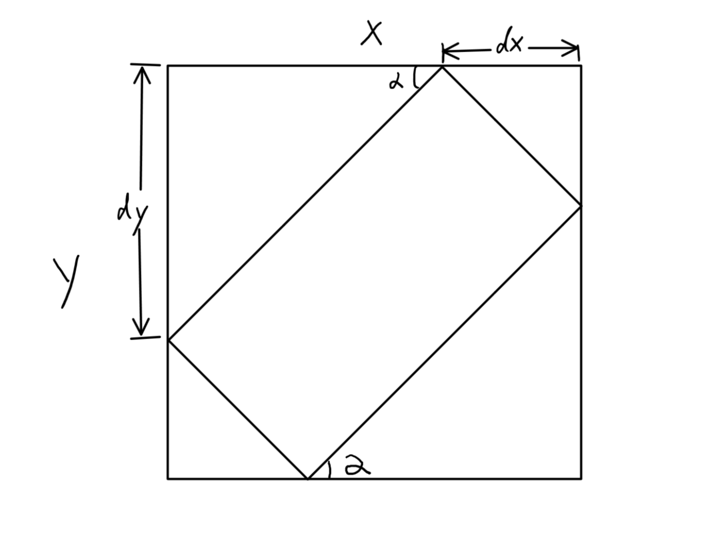

# 一个简单的基于颜色检测的C++标准库车牌识别

[English](README.md)

***
1. 本程序仅仅使用C++标准库实现，不引入任何三方库
2. 搭建平台：VS2017 + Windows SDK 10.0.10240.0
3. 注意事项：若要使用低于VS2017版本的VS进行编译请先将项目转换为对应的版本。  
***

## 使用说明：
  * 使用VS2017打开并运行程序
  * 输入图片路径
  * 终端显示图片元信息，找到的连通域信息，并打印计算全过程的时间；
  * 键入任意字符回车结束程序；
  * 结束运行后找到生成的`Output/edited_Output.bmp`文件查看识别效果。
  * 处理的中间过程同样输出到`Output/`文件夹中

## 处理流程
  * `img.imRead(fileName)`  
    从文件名中读取文件  
  * `Rgb2Hsv(&imgHSV1)`   
    将RBG文件转换为HSV
  * `HsvColorDetect(&imgHSV1, &imgHSV2)`   
    识别图像中的蓝色和黄色，标记特征区域，将图像二值化。
  * `Inflation(&imgHSV2, &imgHSV3, 7, 7)`  
    图像膨胀，将相邻区域连起来，形成连通域，膨胀尺度为7\*7px。
  * `Erosion(&imgHSV3, &imgHSV4, 6, 6)`  
    图像腐蚀，将连通域边界缩回到原位置，腐蚀尺度为6\*6px。
  * `ConnectedRegion(&imgHSV4, &imgHSV5, featureList)`  
    使用种子膨胀法（深度优先搜索）寻找并记录图像中的连通域，将所有的连通域信息(面积，外接矩形的位置信息)存放在`featureList`中。
  * `Robert(&imgHSV4, &imgHSV6, 1)`  
    使用Robert算子提取所有连通域的边缘。

    ----接下来对每一个连通域进行单独处理-----

  * `lineDect(it->boundingbox, &imgHSV6)`  
    假定每一个连通域皆为矩形，检测每一个连通域边缘直线的斜率，从而得到连通域的旋转角度。具体方式是对边缘图进行Hough变换得到图中最长的直线的斜率，并认为该直线为连通域最长边沿的斜率。
  * `countVertices(it->boundingbox);`  
    根据得到的斜率对该连通域的外接矩形参数进行校正，计算出连通域矩形四个顶点准确的位置。
  * 筛选连通域
  ```c++
  if ((area > img.width * img.height / 400
       && area < img.width * img.height / 10)
       && ((a / b >= 2) || (b / a >=2)))
  ```  
  根据顶点位置可以算出矩形面积和长宽比，根据车牌特征，滤除所有不符合条件的连通域。算法如图所示

  
  
  * `rectangle(&OutputImage, it->boundingbox, 255)`  
    在原始图像中用红框标记出符合条件的连通域矩形。
  * `OutputImage.imWrite()`  
    输出画好的图像。

## 效率分析
  * 本项目使用基于图像颜色的识别方法。对于像素数量为n的图像，具体效率如下：  
      (1). RGB转HSV: O(3n);  
      (2). 蓝色和黄色的识别：O(2n\*3)=O(6n);  
      (3). 7\*7图像膨胀: O(7\*7\*n)=O(49n);  
      (4). 6\*6图像腐蚀: O(6\*6\*n)=O(36n);  
      (5). 连通域查找: O(n);  
      (6). 边缘提取: O(4n);  
      (7). 直线检测: O(180\*1200\*n)=O(216000n);  
      (8). 寻找顶点: O(1);  
      (9). 画出矩形: O(&radic;n);  
  * 综上，本项目的效率大约是O(216063n)左右。

## 准确性分析
  * 考虑到本项目不允许使用图像处理库，在识别算法的选取上不能有太高的运算复杂度和代码量的要求。若使用基于边沿检测的方法，噪声干扰过强，在无法使用神经网络的情况下无法取得比较好的效果。因此选择基于颜色的检测，牺牲了对一部分特殊颜色车牌的识别率的情况下，对绝大多数的蓝色和黄色车牌具有最好的效果。
  * 对于所给测试集中的图像检测成功率为100%
  * 无法检测蓝色车身下的蓝色车牌和黄色客车身下的黄色客车牌。
  * 无法检测车牌超过图片1/10大小或小于图片1/400大小的极端情况
  * 无法识别竖直方向放置的车牌。
  * 对于除以上三点外其他情况的车牌检测成功率基本能达到100%
  * 可以精确识别出车牌在图片中的倾斜，并调整标记位置。
